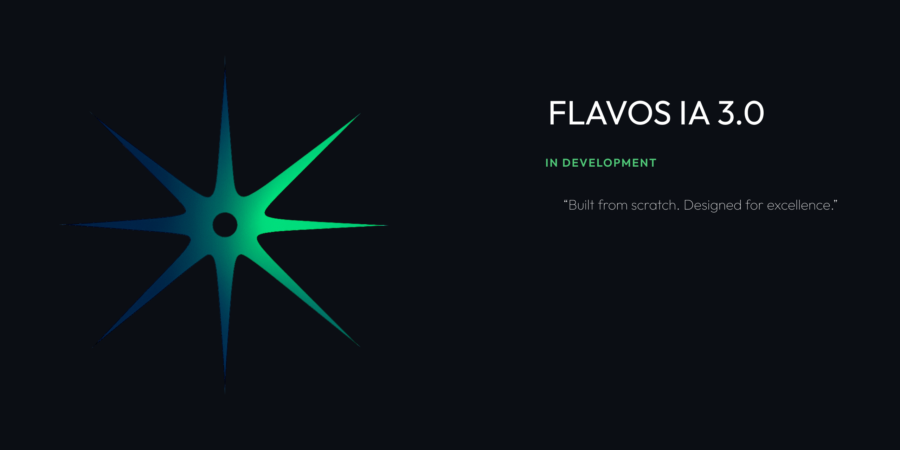

# 🚀 Flavos IA 3.0 – **Phase 1 Concluída!** 🎉  

## 🔄 **O que foi feito hoje (07/03/2026)**

Migração completa para arquitetura Monorepo e Redesign Minimalista:

- ✅ **Arquitetura Monorepo**: Transição do PWA antigo para estrutura Turborepo com React (Web) e Expo (Mobile).
- ✅ **Backend Proxy Seguro**: Implementação de servidor Express com suporte ao modelo `gemini-3.1-flash-lite-preview` via `@google/genai`, mantendo a API Key protegida.
- ✅ **Redesign Minimalista 3.0**: Interface inspirada no Gemini com paleta de cores Azul ↔ Verde-Floresta e tipografia `Outfit`.
- ✅ **Sidebar Inteligente**: Nova barra lateral para gerenciamento de chats (estrutural para futura integração Firebase).

---

## 🛠️ Roadmap de Desenvolvimento (Fases)

### 🔹 Fase 1: Fundação & Monorepo (ATUAL)
- [x] Configuração centralizada (Turborepo + TS).
- [x] Shared package com hooks, tipos e componentes base.
- [x] Backend proxy para requisições seguras.
- [x] UI/UX 3.0 Minimalista (Web).

### 🔸 Fase 2: Persistência & Mobile
- [ ] Integração completa com **Firebase/Firestore**.
- [ ] Renderização e polimento da versão **Mobile (Expo)**.
- [ ] Histórico de mensagens real-time.

### 🔺 Fase 3: Mídia & Funcionalidades Avançadas
- [ ] Upload de arquivos (PDF, imagens, áudio).
- [ ] Streaming de mensagens.
- [ ] Visualizadores de mídia nativos no chat.

### 🏁 Fase 4: Autenticação & Produção
- [ ] Firebase Auth (Login Social + Email).
- [ ] Edição de mensagens.
- [ ] Deploy v1.0 Production.

---

## 💬 Gerenciamento de Conversas (3.0)
✅ **Sidebar de Navegação**  
- Botão "Novo Chat" funcional com limpeza de estado.  
- Lista de chats com estados de hover e transições suaves.  

✅ **Interface Minimalista "Flat"**  
- Saudações dinâmicas e chips de sugestão de prompt.  
- Bolhas de chat sutis para o usuário e texto direto para IA.  

✅ **Scroll Automático & Performance**  
- Utiliza hooks customizados (`useChat`) para gerenciamento eficiente de mensagens.  

---

## 🗂️ **Status da Produção**

| Etapa | Status | Descrição |
|-------|--------|-----------|
| 🔹 Fase 1 | ✅ Concluída | Fundação monorepo, backend e redesign minimalista |
| 🔸 Fase 2 | ⏳ Em breve | Firebase, auth e suporte mobile completo |
| 🔺 Fase 3 | 📋 Planejado | Funcionalidades de mídia, arquivos e IA avançada |
| 🏁 Fase 4 | 📋 Planejado | Polimento final, edição e lançamento oficial |

---

## 🧠 Sobre o Projeto  

**Flavos IA 3.0** é a evolução definitiva da plataforma, focada em escala, segurança e uma experiência de usuário premium. Modular por design, cada parte da aplicação (Web, Mobile e Backend) compartilha a mesma inteligência e sistema de design.

---

## 📦 Detalhes Técnicos

- **Core:** React 19, Expo, Node.js
- **IA:** Google Gemini 3.1-flash
- **Styles:** Styled-components & CSS Variables
- **State:** Zustand

**📅 Última atualização:** `07/03/2026`  
**🧑💻 Desenvolvedor:** Kauã Jorge  
**🎨 Design:** Flavos IA Team
