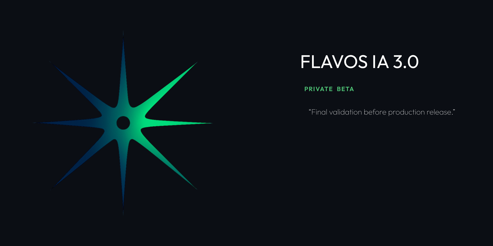

# 🚀 Flavos IA 3.0 – **Phase 4 CONCLUÍDA — Lançamento: 04/04/2026** 🎉  

## ✅ **Fase 4 — 100% Finalizada (29/03/2026)**

O ciclo de desenvolvimento do Flavos IA 3.0 está **encerrado**. O projeto atingiu maturidade total — arquitetura resiliente, segurança de nível corporativo, UX *premium* e infraestrutura de produção configurada. Os marcos entregues nesta fase final foram:

- ✅ **Ciclo de Mensagens (Superseded)**: Edição segura de mensagens com árvore lógica de substituição (*superseded pattern*), incluindo suporte a regeneração imediata e autônoma da IA ao editar respostas, sem poluir a timeline do Firestore.
- ✅ **Lixeira Premium & Automação**: Suporte a *Soft-Delete* e exclusões definitivas (*Hard-Delete*). Visão unificada de Trash na Web/Mobile com suporte a "Restaurar". Endpoint admin para CRON (`/cleanup-trash`) com expiração automática após 4 dias.
- ✅ **Security Hardening (API+DB)**: Firestore rules blindando injeções *superseded*. Rota administrativa protegida com *Bearer token*, `timingSafeEqual` e *rate limits* anti-bruteforce.
- ✅ **Resiliência Server & Rate Limit**: Correção de validação IPv6/IPv4 (`trust proxy`). Interceptação inteligente de `429 / RESOURCE_EXHAUSTED` da Gemini API.
- ✅ **Error Handling Premium**: Sistema `AiError` com banners *Glassmorphism* (web/mobile), retry temporizados com countdown reativo e fallbacks contextuais.
- ✅ **UI/UX Polish (Web & Mobile)**: Chat Input multiline com `flex-end`, sem sobreposição de teclado. Polimento visual completo em Sidebar, modais e transições.
- ✅ **Code Blocks Interativos**: Estilo macOS + Dracula theme, toggle minimizar/expandir, cópia e download por linguagem.
- ✅ **Infraestrutura de Deploy**: Backend configurado com PM2 (650M), Nginx, CORS para Cloudflare Pages e Firebase Admin SDK integrado ao cron job.

---

## 🛠️ Roadmap de Desenvolvimento (Fases)

### 🔹 Fase 1: Fundação & Monorepo (CONCLUÍDA)
- [x] Configuração centralizada (Turborepo + TS).
- [x] Shared package com hooks, tipos e componentes base.
- [x] Backend proxy estrutural para requisições seguras.

### 🔸 Fase 2: Persistência & Mobile (CONCLUÍDA)
- [x] Integração completa com base **Firebase/Firestore**.
- [x] Redesign autoral Mobile reescrito no **Expo**.
- [x] Histórico de mensagens real-time.
- [x] Integração do **Google Search Grounding** na engine de processamento de prompts.

### 🔺 Fase 3: Mídia & Funcionalidades Avançadas (CONCLUÍDA)
- [x] Upload multi-formato (PDF, Imagens, Áudios, Vídeos) e visualização nativa embutida.
- [x] Interface minimalista para Gemini Thoughts (resumo de pensamento colapsável).
- [x] Pin To Top — painéis de fixação cross-platform e persistentes em *storage* global.
- [x] Persistência fluída de Multi-Temas (*Light/Dark*) sem cintilação na transição.

### 🏁 Fase 4: Polimento Final & Produção (**CONCLUÍDA ✅**)
- [x] Autenticação Firestore unificada (Email + Social Login).
- [x] Ciclo Superseded de Edição, Reciclagem de Mensagens (Trash) e automação agendada.
- [x] UI/UX Flat Polish Master (Inputs expansíveis e reajuste sem redesenho massivo).
- [x] Rate Limit Intelligence nativos e Sistema Autônomo de Recuperação 429 Error Banners.
- [x] QA final e hardening de infraestrutura de deploy.
- [x] **Deploy v1.0 Production — Concluído em 29/03/2026**.

---

## 💬 Gerenciamento de Conversas (3.0)

✅ **Lixeira Premium e Edição Assessorada**  
- Lógica completa e nativa para deleção de soft e hard-delete sob controle corporativo, permitindo reciclagem e recuperação de instâncias limpas; regeneração integrada na aba ativa via árvore *superseded*.

✅ **Organização Limpa (Sidebar Control)**  
- Modais e menus drop-down no mobile centralizados e ancorados sem invasão. Fixação de prioridades intuitivas sem descaracterizar listas grandes através do 'Pin'.

✅ **Scroll Automático Seguro (SSE Resiliente)**  
- Pipeline protegida desde a recepção de rede a UI reativa utilizando Zustand para amortizar eventos abruptos (seja travamento total ou streams massivas em blocos minimizáveis).

---

## 🗂️ **Status da Produção**

| Etapa | Status | Descrição |
|-------|--------|-----------|
| 🔹 Fase 1 | ✅ Concluída | Fundação monorepo, backend seguro e base React/Expo. |
| 🔸 Fase 2 | ✅ Concluída | Firebase Auth, Sync persistente, Google Grounding e UX transativa Mobile consolidada. |
| 🔺 Fase 3 | ✅ Concluída | Mídia nativa rica, Uploads fluidos, Gemini Thoughts e personalizações modulares seguras. |
| 🏁 Fase 4 | ✅ **CONCLUÍDA** | Deploy realizado. Infraestrutura configurada. Anúncio ao público em **04/04/2026**. |

---

## 🧠 Sobre o Projeto  

**Flavos IA 3.0** é um produto de plataforma completa — Web, Mobile nativo (Expo) e Backend proxy seguro — construído do zero em arquitetura Monorepo modular. Com persistência em Firebase Firestore, integração com Google Gemini, suporte a mídia nativa e um sistema de chat resiliente com streaming SSE, representa o estado da arte em aplicações de IA conversacional independentes.

---

## 📦 Detalhes Técnicos

- **Core:** React 19, Expo, Node.js + Turborepo
- **IA:** Google Gemini 2.5-flash
- **Styles:** CSS Variables (Web) + StyleSheet (RN)
- **State:** Zustand Hooks e Store Central
- **Storage:** Firebase Firestore (Rules Tier 3) + AsyncStorage Local Fallback
- **Deploy:** VPS AMD EPYC + PM2 + Nginx | Cloudflare Pages

**📅 Última atualização:** `29/03/2026`  
**🧑‍💻 Desenvolvedor:** Kauã Jorge  
**🎨 Design:** Flavos IA Team
